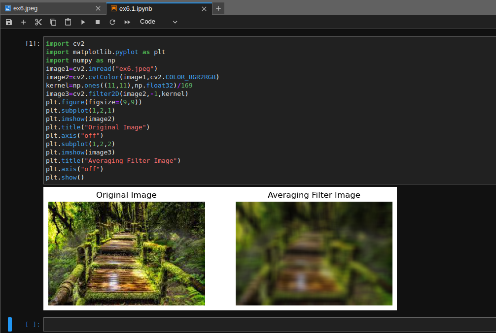
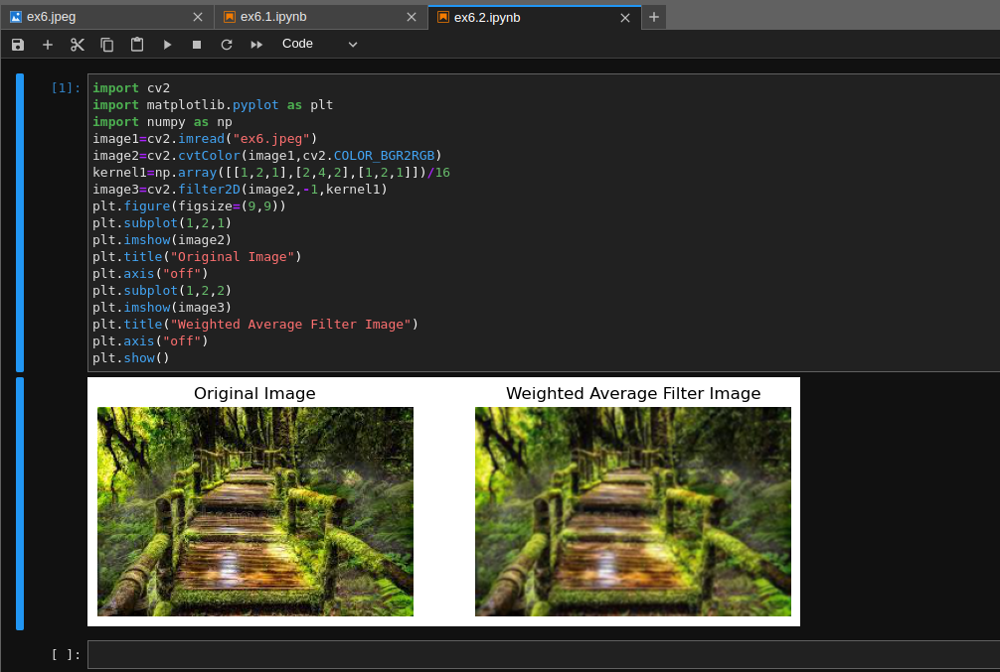
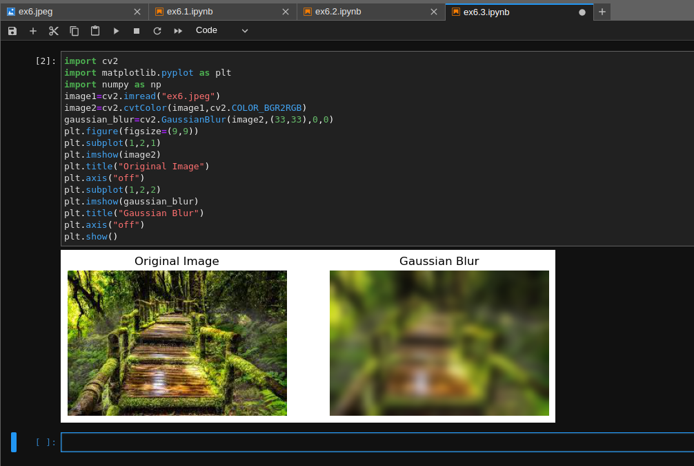
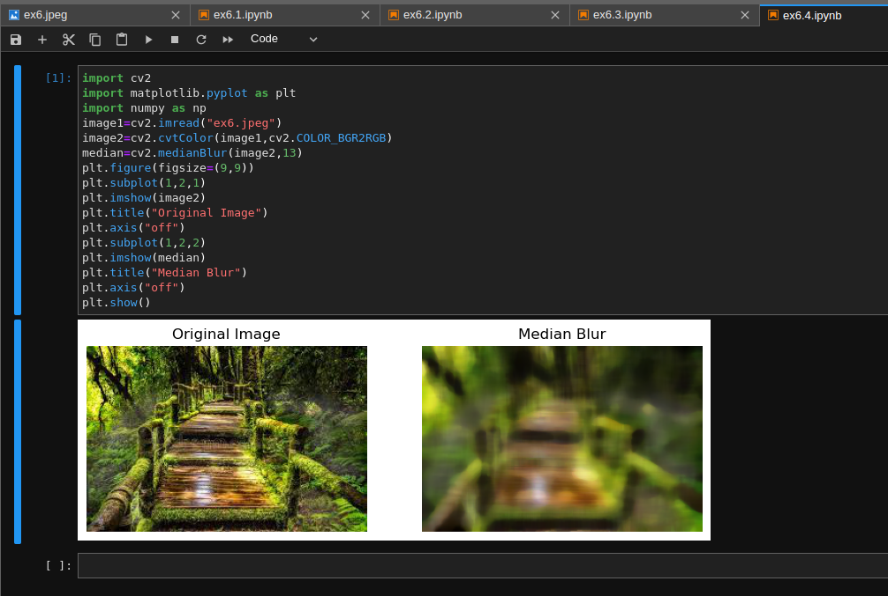
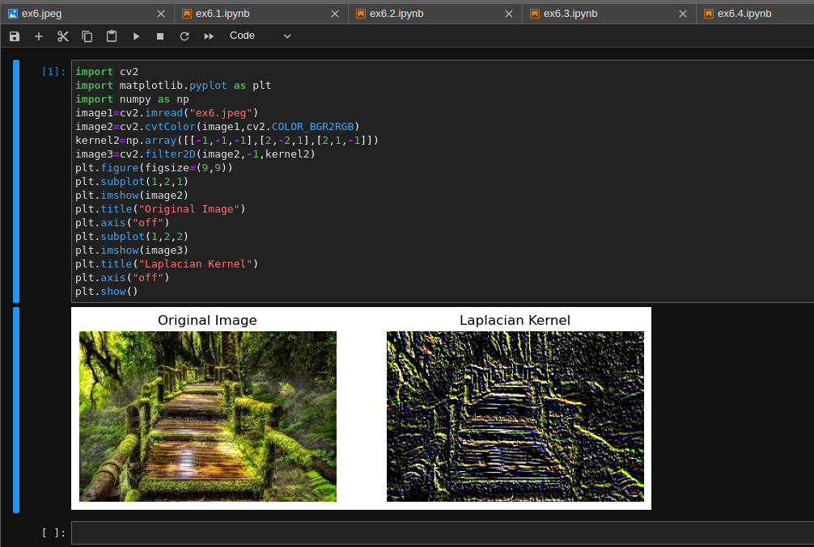
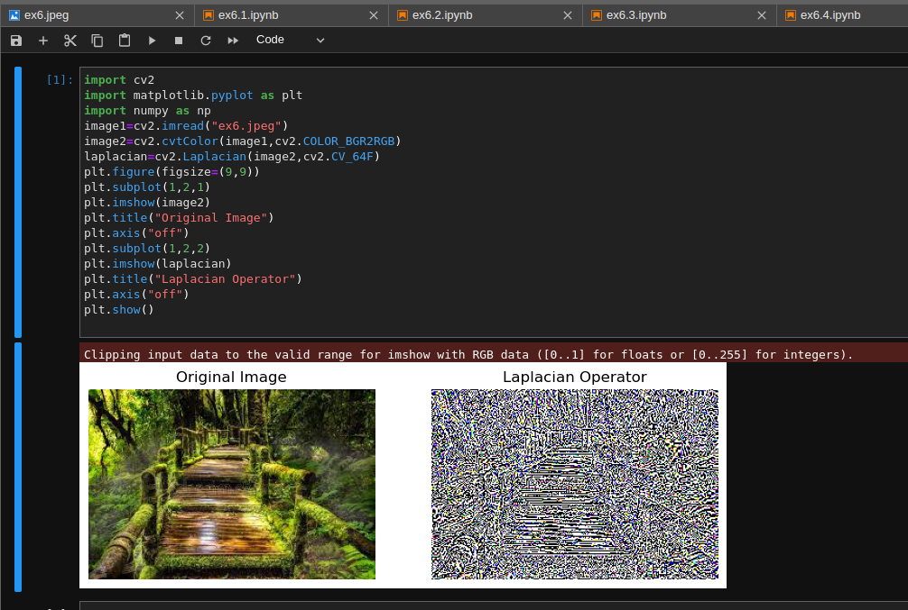

# Implementation-of-Filters
## Aim:
To implement filters for smoothing and sharpening the images in the spatial domain.

## Software Required:
Anaconda - Python 3.7

## Algorithm:

## Step1:
Import the necessary modules.

## Step2:
Perform smoothing operation on a image.

Average filter

Weighted average filter

Gaussian Blur

Median filter

## Step3:
Perform sharpening on a image.

Laplacian Kernel

Laplacian Operator

## Step4:
Display all the images with their respective filters.

## Program:
```pyhton
### Developed By   : Sai Praneeth K
### Register Number: 212222230067
```
### 1. Smoothing Filters

i) Using Averaging Filter
```Python
import cv2
import matplotlib.pyplot as plt
import numpy as np
image1=cv2.imread("ex6.jpeg")
image2=cv2.cvtColor(image1,cv2.COLOR_BGR2RGB)
kernel=np.ones((11,11),np.float32)/169
image3=cv2.filter2D(image2,-1,kernel)
plt.figure(figsize=(9,9))
plt.subplot(1,2,1)
plt.imshow(image2)
plt.title("Original Image")
plt.axis("off")
plt.subplot(1,2,2)
plt.imshow(image3)
plt.title("Averaging Filter Image")
plt.axis("off")
plt.show()
```

ii) Using Weighted Averaging Filter
```Python
import cv2
import matplotlib.pyplot as plt
import numpy as np
image1=cv2.imread("ex6.jpeg")
image2=cv2.cvtColor(image1,cv2.COLOR_BGR2RGB)
kernel1=np.array([[1,2,1],[2,4,2],[1,2,1]])/16
image3=cv2.filter2D(image2,-1,kernel1)
plt.figure(figsize=(9,9))
plt.subplot(1,2,1)
plt.imshow(image2)
plt.title("Original Image")
plt.axis("off")
plt.subplot(1,2,2)
plt.imshow(image3)
plt.title("Weighted Average Filter Image")
plt.axis("off")
plt.show()
```

iii) Using Gaussian Filter
```Python
import cv2
import matplotlib.pyplot as plt
import numpy as np
image1=cv2.imread("ex6.jpeg")
image2=cv2.cvtColor(image1,cv2.COLOR_BGR2RGB)
gaussian_blur=cv2.GaussianBlur(image2,(33,33),0,0)
plt.figure(figsize=(9,9))
plt.subplot(1,2,1)
plt.imshow(image2)
plt.title("Original Image")
plt.axis("off")
plt.subplot(1,2,2)
plt.imshow(gaussian_blur)
plt.title("Gaussian Blur")
plt.axis("off")
plt.show()
```

iv) Using Median Filter
```Python
import cv2
import matplotlib.pyplot as plt
import numpy as np
image1=cv2.imread("ex6.jpeg")
image2=cv2.cvtColor(image1,cv2.COLOR_BGR2RGB)
median=cv2.medianBlur(image2,13)
plt.figure(figsize=(9,9))
plt.subplot(1,2,1)
plt.imshow(image2)
plt.title("Original Image")
plt.axis("off")
plt.subplot(1,2,2)
plt.imshow(median)
plt.title("Median Blur")
plt.axis("off")
plt.show()
```

### 2. Sharpening Filters
i) Using Laplacian Kernal
```Python
import cv2
import matplotlib.pyplot as plt
import numpy as np
image1=cv2.imread("ex6.jpeg")
image2=cv2.cvtColor(image1,cv2.COLOR_BGR2RGB)
kernel2=np.array([[-1,-1,-1],[2,-2,1],[2,1,-1]])
image3=cv2.filter2D(image2,-1,kernel2)
plt.figure(figsize=(9,9))
plt.subplot(1,2,1)
plt.imshow(image2)
plt.title("Original Image")
plt.axis("off")
plt.subplot(1,2,2)
plt.imshow(image3)
plt.title("Laplacian Kernel")
plt.axis("off")
plt.show()
```

ii) Using Laplacian Operator
```Python
import cv2
import matplotlib.pyplot as plt
import numpy as np
image1=cv2.imread("ex6.jpeg")
image2=cv2.cvtColor(image1,cv2.COLOR_BGR2RGB)
laplacian=cv2.Laplacian(image2,cv2.CV_64F)
plt.figure(figsize=(9,9))
plt.subplot(1,2,1)
plt.imshow(image2)
plt.title("Original Image")
plt.axis("off")
plt.subplot(1,2,2)
plt.imshow(laplacian)
plt.title("Laplacian Operator")
plt.axis("off")
plt.show()
```

## OUTPUT:
### 1. Smoothing Filters

i) Using Averaging Filter


ii) Using Weighted Averaging Filter


iii) Using Gaussian Filter


iv) Using Median Filter


### 2. Sharpening Filters

i) Using Laplacian Kernal


ii) Using Laplacian Operator


## Result:
Thus the filters are designed for smoothing and sharpening the images in the spatial domain.
